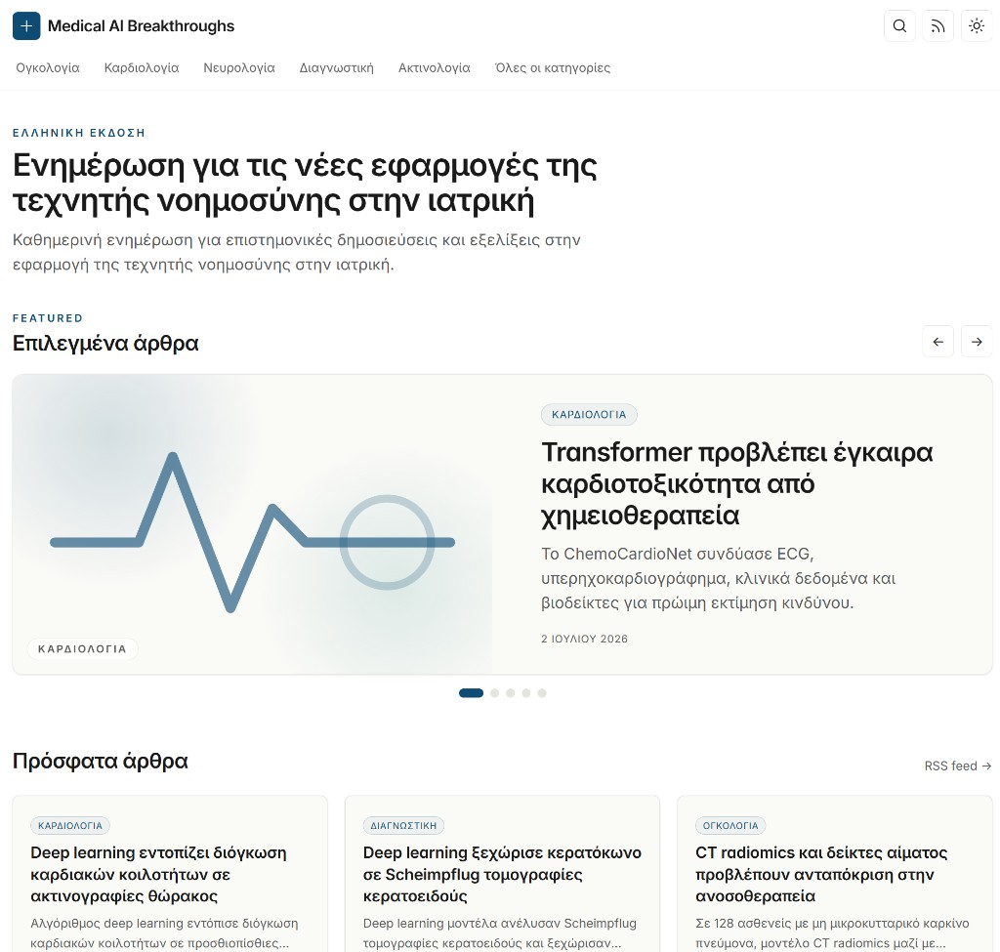
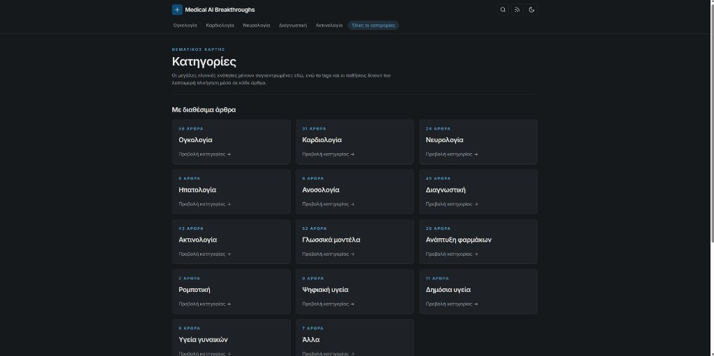

# Medical AI Breakthroughs

A Greek-language news site about artificial intelligence in medicine, paired with an automated content pipeline that sources, scores, and summarizes medical-AI research into publication-ready articles.

**Live site:** [aimedical.gr](https://aimedical.gr)

## Screenshots

| Homepage | Categories |
| -------- | ---------- |
|  |  |

The frontend is a fully static Astro site — editorial layout, dark mode, category navigation, featured carousel, and RSS feed.

## Project structure

| Directory | What it is | Stack |
| --------- | ---------- | ----- |
| [`fe/`](fe/) | Static Greek news site (the public website) | Astro 5 + Tailwind 3 + MDX, deployed to S3 behind Cloudflare |
| [`be/`](be/) | Content pipeline that generates the articles | Python 3.12 AWS Lambda |

## AI pipeline

A single Python Lambda (`medical_news.handlers.orchestrator.handler`) runs the full content pipeline. It is triggered on a schedule (every 6 hours via EventBridge) and can also be invoked locally via the scripts in `be/scripts/`.

```
fetch (PubMed + arXiv + curated RSS)
  → dedupe (DynamoDB)
  → relevance score (OpenAI)
  → Greek article generation (OpenAI)
  → MDX file
  → GitHub PR (draft)
  → mark processed (DynamoDB)
```

### 1. Fetch

The orchestrator pulls recent candidates from three scheduled sources:

| Source | Module | What it fetches |
| ------ | ------ | --------------- |
| PubMed | `medical_news/feeds/pubmed.py` | Medical-AI papers via NCBI E-utilities |
| arXiv | `medical_news/feeds/arxiv.py` | Preprints in relevant CS/bio categories |
| RSS | `medical_news/feeds/rss.py` | Curated journal and society feeds |

Additional invoke scripts cover one-off batches that bypass the default fetch:

- `invoke_topic.py` — ad-hoc PubMed/arXiv query
- `invoke_rss.py` — RSS-only run
- `invoke_disease_advances.py` — curated disease/society breakthrough feeds (skips relevance scoring)
- `invoke_fda_drugs.py` — FDA Drugs@FDA approvals via openFDA (skips relevance scoring)

### 2. Dedupe

Each article gets a stable key in DynamoDB (`aimedical_articles`):

- Prefer DOI: `ARTICLE#10.xxxx/...`
- Fallback: `ARTICLE#<source>#<sourceId>`

Already-processed articles are skipped. Low-relevance articles are also recorded so they are not re-scored on every run.

### 3. Relevance scoring (OpenAI)

`medical_news/ai/relevance.py` sends title + abstract to the model and returns:

```json
{ "relevant": true, "score": 8, "category": "oncology", "reason": "..." }
```

Scoring dimensions: medical relevance, AI relevance, public interest, novelty, readability. Articles below `RELEVANCE_MIN_SCORE` (default **7**) are dropped. The model also assigns one of 14 clinical categories (oncology, cardiology, neurology, llms, drug-discovery, etc.).

FDA and disease-advance batches skip this step and use a fixed category override instead.

### 4. Greek article generation (OpenAI)

`medical_news/ai/generator.py` produces a structured `GreekArticle` JSON object:

- Greek title, subtitle, SEO description
- Body with standard sections (`## Τι συνέβη`, `## Γιατί έχει σημασία`)
- Tags, conditions, key findings, study limitations, clinical significance

Editorial guardrails are enforced in `medical_news/ai/prompts.py`:

- No sensationalism or hype language
- Always mention study limitations
- Never generate medical advice
- Distinguish peer-reviewed from preprints
- Write naturally in Greek, not as a translation

### 5. MDX + GitHub PR

`medical_news/markdown/mdx.py` builds a frontmatter-compliant `.mdx` file and commits it to `fe/src/content/articles/<year>/<slug>.mdx` via the GitHub API.

Each run opens a **draft pull request** (one PR per article, or a single batch PR when `GITHUB_BATCH_PR` is set). **PR review is the quality gate** — a human reviews the generated content before merging.

### 6. Deploy

Once merged to `main`, the GitHub Actions workflow (`.github/workflows/deploy.yml`) builds the Astro site and syncs `dist/` to S3. Cloudflare CDN serves the static output.

```
Lambda (every 6h)  →  draft PR  →  human review  →  merge to main  →  S3 deploy
```

## Running locally

The two halves run independently. The frontend reads MDX files already committed to the repo, so you can develop the site without running the pipeline.

### Frontend (`fe/`)

```bash
cd fe
npm install
npm run dev      # http://localhost:4321
```

Other scripts: `npm run build` (static build → `dist/`), `npm run preview`, `npm run check` (type + content schema check).

See [`fe/README.md`](fe/README.md) for the layout, design system, and how to add an article by hand.

#### Remove unpublished articles

Articles with `published: false` are not rendered on the site. To find them:

```bash
grep -rl '^published:\s*false' fe/src/content/articles --include='*.mdx'
```

To delete them (preview the list above first):

```bash
grep -rl '^published:\s*false' fe/src/content/articles --include='*.mdx' | xargs rm
```

### Backend (`be/`)

```powershell
cd be
python -m venv .venv
.venv\Scripts\activate
python -m pip install -r requirements.txt
copy .env.example .env   # fill in real values
python scripts/invoke_local.py
```

> [!WARNING]
> There is no mock mode. `python scripts/invoke_local.py` hits **real** PubMed/arXiv, OpenAI, GitHub, and DynamoDB, and will open a real draft PR. Use the `--dry-run` flag on the preview scripts (e.g. `python scripts/invoke_rss.py --dry-run`) to inspect candidates without side effects.

Required environment variables (see `be/.env.example`): `OPENAI_API_KEY`, `OPENAI_MODEL`, `GITHUB_TOKEN`, `REPO_OWNER`, `REPO_NAME`, `REPO_DEFAULT_BRANCH`, `AWS_REGION`, `DYNAMODB_TABLE`.

See [`be/README.md`](be/README.md) for all invoke scripts, the FDA/RSS feeds, deployment, and pipeline invariants.

## Repository layout

```
.
├── fe/              Astro frontend (the website)
├── be/              Python Lambda content pipeline
├── docs/
│   └── images/      README screenshots
└── .github/         deploy + scheduling workflows
```
